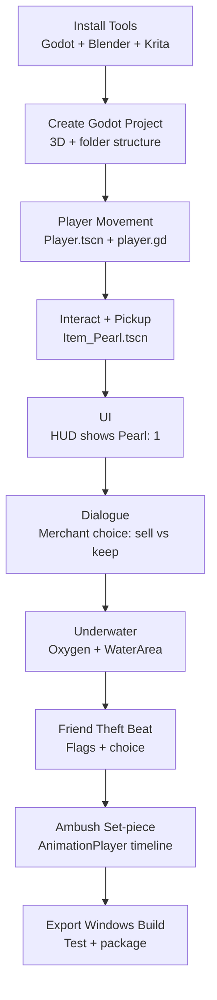

# Start Here (Beginner Guide) — Godot + Blender + Krita (Windows)

You’re starting from zero. This guide is a **step-by-step, easy** path to get your project running, with a **visual roadmap** and a first playable prototype.

The game you’re building is the vertical slice described in `GDD.md`: **Aithu finds the pearl → choices → merchant/friend beats → ambush ending**.

---

## What you need (install once)

**1) Godot (engine)**
- Install **Godot 4.x**.
- Create a folder you will keep forever (example): `D:\Games\PearlGame\`

**2) Blender (3D)**
- Install Blender.
- You’ll export models as **glTF 2.0 (`.glb`)**.

**3) Krita (2D)**
- Install Krita.
- You’ll use it for **UI images**, icons, and simple textures.

**4) Backups (important)**
- Create a backups folder outside your project (another drive if possible).
- After each milestone (end of Day 1, Day 2, etc.), zip the whole project folder.

---

## Visual Roadmap (do this in order)

Paste this diagram into any Markdown viewer that supports Mermaid (VS Code does):



---

## Project folder structure (simple and clean)

Inside your Godot project folder, create these folders (you can create them from Windows Explorer):

- `scenes/`
- `scripts/`
- `assets/3d/`
- `assets/2d/`
- `audio/`
- `materials/`
- `fx/`
- `build/`

Why: you’ll always know where things go.

---

## Day 1: Create the Godot project (15–30 minutes)

1. Open Godot.
2. Click **New Project**.
3. Name it something simple: `PearlGame`.
4. Choose **Renderer**: default is fine for now.
5. Create the project.

### Create the first scenes
In Godot:
1. Create a new scene → **Node3D** → save as `scenes/Main.tscn`.
2. Create another new scene → **CharacterBody3D** → save as `scenes/Player.tscn`.
3. In `Player.tscn`, add:
   - `CollisionShape3D`
   - `MeshInstance3D` (temporary capsule or cube)
   - A `Camera3D` (third-person: put it behind the player)

### Set the main scene
1. Go to **Project Settings → Application → Run**.
2. Set **Main Scene** to `scenes/Main.tscn`.

---

## Day 2: Input (10 minutes) + player movement (60–120 minutes)

### A) Add input actions
Go to **Project Settings → Input Map** and add these actions:

- `move_forward` (W)
- `move_back` (S)
- `move_left` (A)
- `move_right` (D)
- `interact` (E)

### B) Add a movement script
1. Open `Player.tscn`.
2. Attach a script to `CharacterBody3D` and save it as `scripts/player.gd`.
3. Start with this beginner-friendly movement (camera-relative is optional later):

```gdscript
extends CharacterBody3D

@export var speed := 5.0
@export var gravity := 18.0

func _physics_process(delta: float) -> void:
  var input_dir := Vector2.ZERO
  input_dir.x = Input.get_action_strength("move_right") - Input.get_action_strength("move_left")
  input_dir.y = Input.get_action_strength("move_back") - Input.get_action_strength("move_forward")

  var direction := Vector3(input_dir.x, 0.0, input_dir.y)
  if direction.length() > 1.0:
    direction = direction.normalized()

  velocity.x = direction.x * speed
  velocity.z = direction.z * speed

  if not is_on_floor():
    velocity.y -= gravity * delta
  else:
    velocity.y = 0.0

  move_and_slide()
```

4. In `Main.tscn`, instance `Player.tscn` into the scene.
5. Press Play. Confirm you can move.

---

## Day 3: Pearl pickup (1–2 hours)

### A) Create the pearl scene
1. New scene → **Area3D** → save as `scenes/Item_Pearl.tscn`.
2. Add:
   - `CollisionShape3D` (sphere)
   - `MeshInstance3D` (sphere)

### B) Pickup script
Attach `scripts/item_pearl.gd` to the `Area3D`:

```gdscript
extends Area3D

signal picked_up

func _ready() -> void:
  body_entered.connect(_on_body_entered)

func _on_body_entered(body: Node) -> void:
  if body.is_in_group("player"):
    picked_up.emit()
    queue_free()
```

### C) Make the player a “player”
In `Player.tscn` select the root node and add it to a group:
- **Node → Groups → Add** → `player`

### D) Track whether the pearl is owned
Simplest newbie approach (for now):
- Add a script to `Main.tscn` root node, store `has_pearl := true/false`, update UI.

---

## Day 4: Simple UI (HUD) (1–2 hours)

Goal: show **Pearl: 0/1**.

1. In `Main.tscn`, add a `CanvasLayer`.
2. Under it add a `Label` named `PearlLabel`.
3. In your `Main.tscn` script:

```gdscript
extends Node3D

var has_pearl := false

@onready var pearl_label: Label = $CanvasLayer/PearlLabel

func _ready() -> void:
  _update_ui()

func _update_ui() -> void:
  pearl_label.text = "Pearl: %d" % (1 if has_pearl else 0)
```

4. Place `Item_Pearl.tscn` in the world, connect its `picked_up` signal to `Main.tscn` and set `has_pearl = true; _update_ui()`.

---

## Week 1 checklist (your first success milestone)

By the end of Week 1 you should be able to:
- Run the game in Godot.
- Move the player around.
- Pick up the pearl.
- See UI update to `Pearl: 1`.

If you hit this, you’re officially building the game.

---

## Week 2–6: Build the vertical slice (based on your existing backlog)

Use these files as your “what to build next” list:
- `docs/SPRINT_BACKLOG.md`
- `docs/SPRINT_TASKS.csv`
- `docs/PROTOTYPE_PLAN.md`

The next big features after Week 1:
1. Merchant dialogue (sell vs keep)
2. Underwater + oxygen mechanic
3. Friend theft beat (flags)
4. Ambush set-piece (AnimationPlayer timeline)
5. Export Windows build

---

## Blender → Godot (easy workflow)

1. Model in Blender.
2. Apply transforms: **Ctrl+A → All Transforms**.
3. Export: **glTF 2.0 (.glb)**.
4. Put `.glb` into `assets/3d/`.
5. In Godot, drag the `.glb` into a scene or instance it.

Tip: start with very simple shapes and replace later.

---

## Krita → Godot (easy workflow)

1. Create UI icons (pearl icon, interact icon).
2. Export as `.png`.
3. Put them in `assets/2d/`.
4. Use them in Godot UI nodes (`TextureRect`, `Button` icons).

---

## Keep it legal + safe

You can be inspired by the film’s emotion and setting, but avoid copying:
- exact dialogue, character likenesses, music, or unique scenes shot-for-shot.

See `docs/LEGAL_RIGHTS_CHECKLIST.md`.
